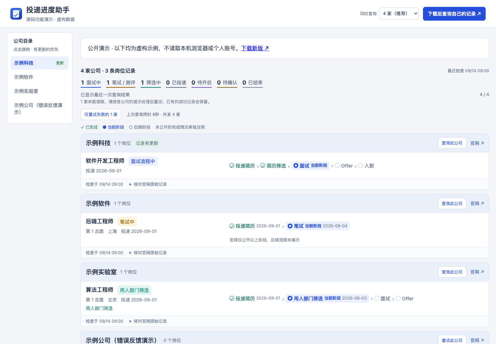
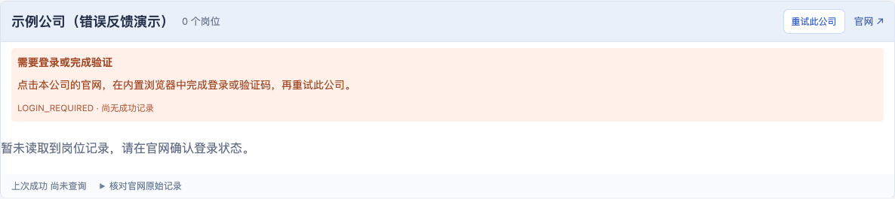
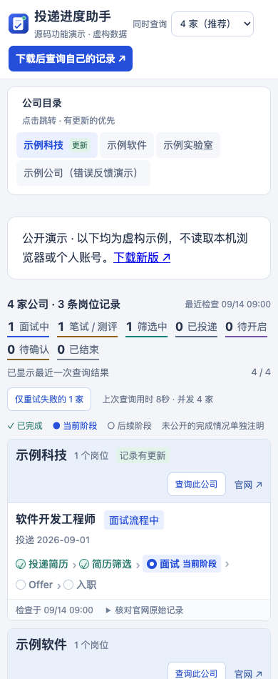

<p align="center"></p>
<h1 align="center">投递进度助手</h1>
<p align="center">Application Monitor · 少开几个标签页，不错过下一步。</p>
<p align="center">把分散在招聘官网的投递记录，汇总成一张保存在本机的进度看板。</p>
<p align="center"><a href="https://github.com/yuzheng310/application-monitor/releases/latest">下载完整启动包</a> · <a href="https://yuzheng310.github.io/application-monitor/demo/">体验虚构数据演示</a> · <a href="AI_USAGE.md">让 AI 帮你使用</a></p>

## 一眼看到，下一步在哪里

投了多家公司之后，不必反复打开每个招聘网站。查询完成后，面试、笔试、筛选和已结束的岗位会显示在同一页；有变化的公司自动排到前面，原始记录也保留下来供核对。



> 展示图片与在线演示全部使用虚构公司、岗位和状态，不包含真实求职者的投递记录、账号或浏览器信息。截图展示当前源码能力，可能领先于已发布安装包。

| 你想做什么 | 软件如何帮助你 |
|---|---|
| 快速查看全部进度 | 默认同时查询 4 家，页面可选 1 / 2 / 4 / 6 / 8 家，逐家显示结果与耗时 |
| 管理面试排期 | 月历与近期安排、编辑和删除、会议链接及时间冲突提示；记录保存在本机 |
| 找到某家公司 | 左侧目录平滑跳转，顶部留出阅读空隙并轻微提示目标公司；高亮当前公司，窄屏目录移到顶部 |
| 优先看有变化的记录 | 带“记录有更新”标记的公司优先显示，同组内按岗位进度排序 |
| 看懂当前阶段 | 用时间线区分已完成、当前和后续阶段，不把流程名称当成通过证据 |
| 处理查询失败 | 页面读取或网络暂时失败会自动重新打开再试一次；持续失败显示原因与处理建议，可单独重试 |
| 核对结果 | 展开官网原始记录与本次变化；失败时保留上次成功结果 |

<table><tr><td width="68%"></td><td width="32%"></td></tr></table>

## 三步开始

1. **下载并完整解压**与你电脑匹配的 [Release 启动包](https://github.com/yuzheng310/application-monitor/releases/latest)。GitHub 的 `Source code` 压缩包仅含源码，不是一键启动包。
2. **打开启动文件**：Windows 双击 `Start.cmd`；macOS 双击 `投递进度助手.app`（旧安装包使用 `Start.command`）；Linux 运行 `./Start.sh`。
3. **登录后查询**：软件打开内置浏览器。在看板中点击各公司的“官网”，自行完成登录，再回到看板点击“一键查询全部”。

完整包已包含 Python 运行时、Node.js、Chromium、OpenCLI 和浏览器扩展。无需另外安装这些依赖；启动时不运行 pip/npm 或下载依赖。招聘官网查询需要联网，登录与验证码由使用者本人完成。请保持内置浏览器打开。

| 系统 | 下载文件 |
|---|---|
| Windows 10/11 · Intel/AMD 64 位 | `application-monitor-windows-x64.zip` |
| macOS 14+ · Apple Silicon | `application-monitor-macos-arm64.tar.gz` |
| macOS 14+ · Intel | `application-monitor-macos-x64.tar.gz` |
| Ubuntu 22.04/24.04 桌面 · Intel/AMD 64 位 | `application-monitor-linux-x64.tar.gz` |

安装包未购买代码签名证书。macOS 如提示开发者无法验证，可在“隐私与安全性”中允许本次打开；Windows 可能显示未知发布者。无需关闭系统安全功能。Linux 依赖系统桌面库，极简服务器及其他发行版不保证直接运行。

## 已经 clone？让 AI 帮你

把下面这句话交给你常用的 AI 编程助手：

> 请先阅读仓库根目录的 AI_USAGE.md，检查我的系统和现有环境，帮我启动投递进度助手；保留已有配置和记录，告诉我哪些登录步骤需要本人完成，并验证能否查询。

[AI_USAGE.md](AI_USAGE.md) 包含环境判断、源码与安装包启动、配置位置、查询接口、添加公司和排错流程。源码可以直接预览看板，但完整查询仍需要浏览器与 OpenCLI 环境；指南会明确区分“页面能打开”和“查询可用”。

## 支持哪些公司

当前源码提供 **27 个**校招或应聘记录入口：

百度 · MiniMax · 得物 · 快手 · 滴滴 · 美团 · 京东 · 蚂蚁集团 · 阿里巴巴 · 小红书 · 携程 · 米哈游 · 库洛游戏 · 商汤 · 同花顺 · 网易游戏 · 科大讯飞 · 小米 · 小鹏汽车 · Momenta · Shopee · 宁德时代（CATL） · 拼多多集团（PDD） · 微软（Microsoft） · 顺丰 · 智元机器人（AGIBOT） · 拓竹科技（Bambu Lab）。

**版本差异：**v1.1.0 安装包已包含并行查询与错误反馈；小鹏汽车、Momenta、Shopee、宁德时代、拼多多、微软、顺丰、智元机器人、拓竹科技、更新优先排序、公司目录及本次视觉更新仍属于后续源码更新。现有用户配置不会被新版示例配置自动覆盖，新增公司需合并到自己的 `sites.json`，可让 AI 按指南完成。

读取规则基于招聘网页，不是官方接口。页面改版、登录失效、空记录或额外验证都可能导致查询失败。软件不提交、修改或撤回申请；当前只展示非实习岗位，不自动翻页或遍历所有招聘年份。状态以招聘官网和 HR 通知为准。

## 桌面窗口

当前源码启动后会以独立应用窗口显示看板，不显示普通标签栏和地址栏。下次构建的 macOS 完整包提供 `投递进度助手.app`，请保留整个解压目录，不要单独移走这个入口。Windows 和 Linux 继续使用原启动文件，也会打开独立窗口。可用 `--browser-tab` 恢复普通标签页，`--no-browser` 仅启动本地服务。关闭窗口不会停止已有后台查询服务，重新打开仍使用原来的记录和排期。此改动尚未发布为新安装包。

## 看懂本次查询的变化

查询时，看板顶部逐家公司汇总具体变化，例如“示例岗位：简历筛选 → 面试中”；公司卡片也会显示最近检查的变化及时间。新增读取到的岗位、状态或阶段变化、岗位信息变化会分别说明。首次读取只建立基准，查询失败不表示状态改变；页面未再显示某岗位时会提示核对，不会直接判定被拒绝。同名岗位无法可靠对应时会明确提示不确定，原始差异仍可展开查看。

顶部仅汇总最近这一批查询，单公司重试不会把其他公司的旧变化混进来。功能升级前的记录保留原始差异，新的详细摘要从下一次查询开始生成。

## 面试跟进

在“面试跟进”里按公司和岗位建立跟进卡片，逐轮记录已完成面试的日期、轮次和备注，保留完整历史；同时维护等待反馈、准备下一轮、已获 Offer 或已结束的状态，以及下一步事项。支持没有走官网的面试流程。结束的跟进默认折叠，仍可编辑和查看。

官网查询成功后，处于面试中的非实习岗位会自动加入跟进；打开跟进页也会补入当前已有的面试岗位。相同岗位不会重复添加，已有的手动轮次、备注、下一步和结束状态均保留。自动加入的岗位显示“待面试”，不推断一面或二面。面试轮次由你亲自维护，完成一面不等于通过一面。若不想继续跟进可标记“已结束”；直接删除但官网仍在面试中的岗位，下次同步会重新加入。未来的具体时间仍在“面试日历”安排；两者目前不自动同步。记录单独保存在用户数据目录的 `data/interview-tracking.json`，备份时一并保留。本功能已进入源码，尚未发布为新安装包。

## 面试日历

在本地看板切换到 **面试日历**，点击 **添加排期**，填写公司、岗位、轮次、开始与结束时间，可附上会议链接和准备事项。公司可自由填写，无需先配置招聘官网。点击日期查看当天安排，或点击“查看近期”按时间查看待参加的面试；在“编辑排期”中可以修改、标记已完成/已取消或删除。

有安排的日期会高亮，并直接显示时间、公司和岗位；点击日期可查看完整排期卡片。已过结束时间、已完成或已取消的安排默认折叠，可随时展开，不会删除或自动改写状态。投递看板中已确认结束的岗位也默认折叠。

时间统一按北京时间（UTC+8）填写和显示。待参加的面试时间重叠时会提示冲突。排期保存在用户数据目录的 `data/interviews.json`，刷新和重启后仍会保留，也不会被投递查询覆盖。当前通过手动录入，不会自动读取邮件或发送提醒。日历已进入源码，尚未包含在 v1.1.0 安装包中。

## 数据留在哪里

看板只监听本机 `127.0.0.1`，默认端口 `18765`。公开网站只提供介绍、演示和下载，无法读取本地看板的数据。内置浏览器使用独立用户目录，不复制日常 Chrome 的登录状态。

| 系统 | 默认用户数据目录 |
|---|---|
| Windows | `%LOCALAPPDATA%\ApplicationMonitor` |
| macOS | `~/Library/Application Support/ApplicationMonitor` |
| Linux | `${XDG_DATA_HOME:-~/.local/share}/application-monitor` |

- `sites.json`：公司入口、并发数、检查时间等配置。
- `data/`：查询结果、变化历史与运行日志。备份记录时复制此目录和 `sites.json`。
- `browser/`：内置浏览器的账号登录状态。不要分享整个用户数据目录。

可用 `APPLICATION_MONITOR_HOME` 指定独立目录。升级时保留用户数据，解压新安装包并启动；关闭网页不等于停止后台服务。卸载程序不会自动删除记录。不要将真实记录、完整日志、Cookie、验证码或带个人参数的链接提交到仓库或 Issue。

## 常见问题

| 现象 | 怎么处理 |
|---|---|
| 需要登录或验证 | 在软件内置浏览器打开该官网，完成登录/验证码，再重试此公司 |
| 未连接到查询浏览器 | 重新启动软件，保持内置浏览器打开，等待扩展连接后重试 |
| 读取超时 / 网络错误 | 确认官网可访问；可降低并发数，仅重试失败公司 |
| 无法识别投递区域 | 确认招聘类别与页面正确；持续失败可能需更新规则，反馈公司名和错误代码即可 |
| 启动包缺少运行文件 | 完整重新解压，不要只移动可执行文件；保留用户数据目录 |
| 端口被占用 | 使用 `ApplicationMonitor --port 18766`，不要关闭不认识的服务 |

并行查询期间，软件会在自己的查询窗口内轮换激活标签页，让依赖可见状态的官网完成渲染，再读取记录；所有查询命令均使用后台模式，不主动将窗口切到前台，网页加载仍可并行。后台模式仍需要浏览器窗口存在，不是无界面运行。查询失败不会覆盖成功记录，也不表示被拒绝。日志位于 `data/web-server.log` 和 `data/web-query.log`，公开反馈前需脱敏。

## 可选：定时检查

启动完整包并保留内置浏览器，然后在包目录运行 `./ApplicationMonitor watch`；Windows 使用 `ApplicationMonitor.exe watch`。默认每天北京时间 09:00、12:00、19:00 检查，时间可在用户配置的 `times` 中调整。

`watch` 会先检查一次，再等待下次时间；Ctrl+C 停止。默认不启用定时任务，也不自动安装开机任务。定时进程持有查询锁，运行时不能同时发起网页或 CLI 查询。电脑休眠、浏览器退出会影响检查。

## 开发与构建

源码看板需要 Python 3.9+：

```sh
python launcher.py --no-browser
```

按命令输出的地址打开网页。这个命令仅启动网页服务，不自动补齐浏览器依赖。需要从源码构建完整包时，在对应目标系统上准备 Python、Node.js/npm，并运行：

```sh
python -m venv .venv
# 先激活虚拟环境，再执行：
python -m pip install -r requirements-build.txt
python -m unittest discover -v
python scripts/build.py
```

构建阶段需要联网获取固定版本依赖，Node 下载检查官方 SHA-256，npm 使用 lockfile 校验。产物位于 `releases/`，不可跨平台使用。Linux 构建机可能需要 `python -m playwright install-deps chromium` 安装桌面库。

GitHub Actions 验证四个平台的构建、自检与启动；推送 `v*` 标签会在构建通过后发布 Release。完整包包含依赖许可证与 `VERSIONS.json`，AI 指南和展示资源也会随下次构建打包。

## 许可证

项目代码与原创图标采用 [MIT](LICENSE)。第三方组件见 [THIRD_PARTY_NOTICES.md](THIRD_PARTY_NOTICES.md)。
